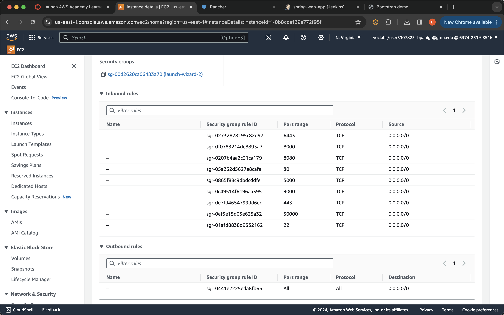
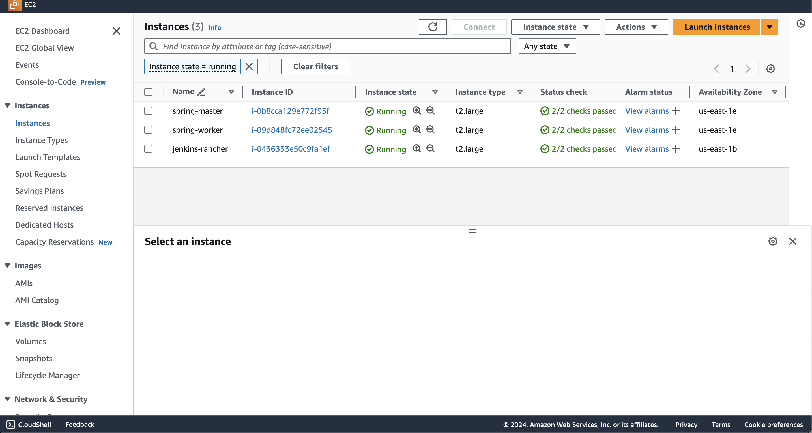
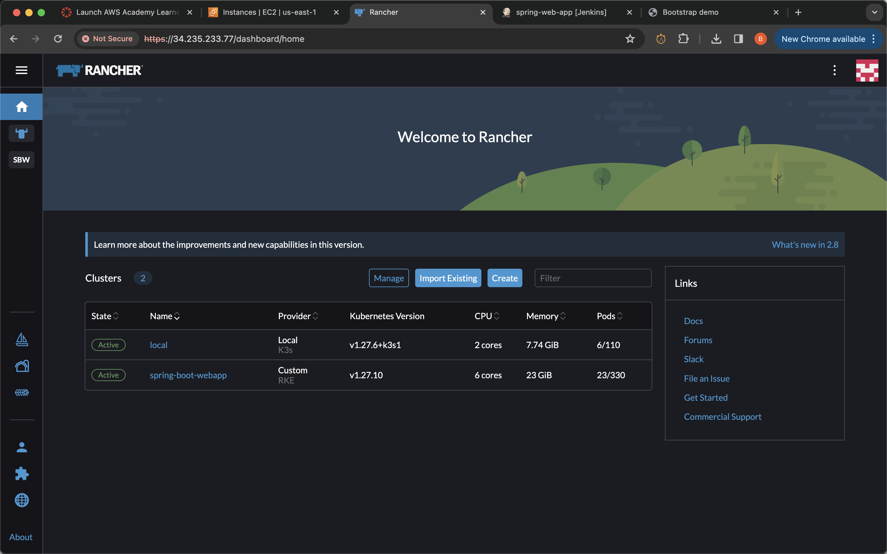
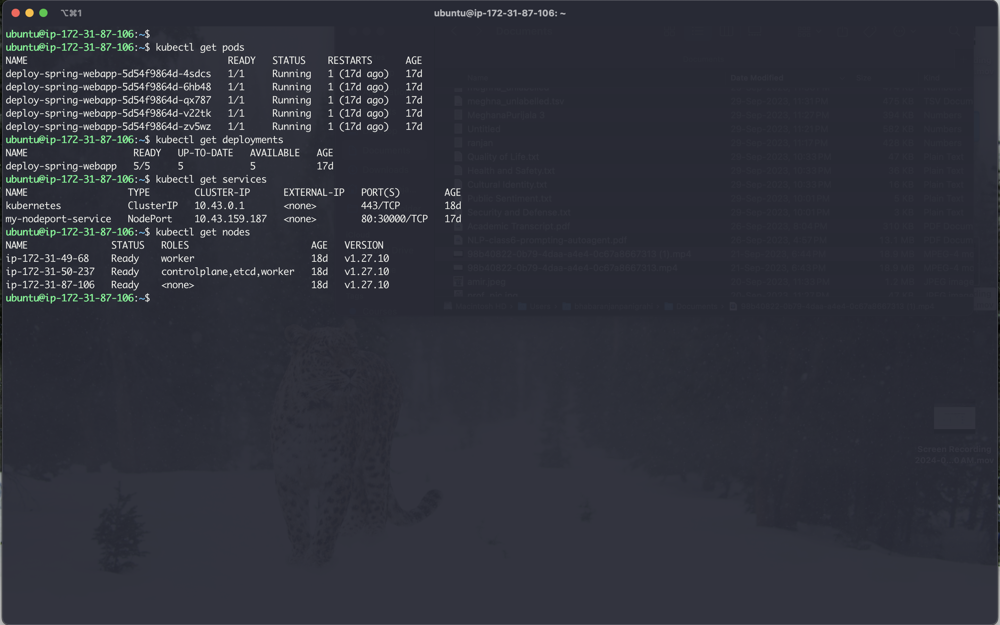

## Overview
[Watch my project video here](https://www.youtube.com/watch?v=GZPE4JriT0o)

## Requirements

- Docker
- AWS Account
- Jenkins
- Kubernetes CLI (kubectl)
- Maven (for Java web app compilation)

## Step 1: Containerization with Docker

1. **Ensure Docker is installed.**
2. **Create a Dockerfile** for a multi-stage build, compiling the app with Maven and packaging it into an Amazon Corretto Java runtime image.
    - Expose port 8080.
    - Ensure the app runs on launch.
3. **Build the Docker image:**
   ```sh
   docker build -t <your-image-name> .

## Step 2: Setup AWS EC2 Instances

1. Choose the Ubuntu AMI.
2. Select `t2.large` instance type.
3. Configure firewall rules.

4. Create and download a key-pair (.pem file) for SSH access.
5. Launch the instances.
   

## Step 3: Setup Rancher for Orchestration

1. SSH into your EC2 instance and install Docker.
2. Install Rancher:
   ```sh
   docker run -d --restart=unless-stopped -p 80:80 -p 443:443 rancher/rancher
   
3. Access the Rancher UI and configure your cluster.
   

## Step 4: Orchestration with Another Instance

1. Update and install Docker:
   \```sh
   sudo apt-get update
   sudo apt install docker.io
   \```
2. Run the command provided by Rancher to start cluster provisioning.

## Step 5: Deploy the Docker Image

1. In Rancher, navigate to **Deployment** under the Workload section.
2. Set replicas and enter the Docker image URI.
3. Setup NodePort as a service.

## Step 6: Setting Up Jenkins and CI/CD Pipeline

1. Install Java 11:
   ```sh
   sudo apt update
   sudo apt install openjdk-11-jdk
   
2. Install Jenkins and start it.
3. Set up a `Jenkinsfile` for defining the Jenkins Pipeline.
4. Pipeline stages include environment variables setup, Docker image build and push, and Kubernetes deployment.

## Commands and Tips

- Useful `kubectl` commands for managing pods, nodes, deployments, and services:
    ```sh
  kubectl get nodes
  kubectl get deployments
  kubectl get pods
  kubectl get services

